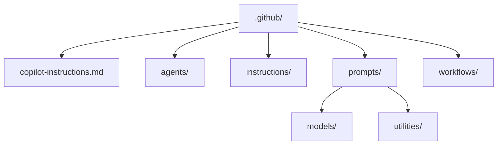

# .github Directory

This directory contains GitHub Actions workflows, GitHub Copilot AI customization files, and shared repository configuration for the trade-exports-packinglistparser (PLP) service.

## Directory Structure

## Files

### `copilot-instructions.md`

The root-level workspace instructions loaded by Copilot on every interaction. Defines:

- Project purpose and the main PLP processing flow
- Naming conventions (camelCase, PascalCase, kebab-case, UPPER_SNAKE_CASE)
- Logging standards (pino, `formatError`, avoid sensitive payload logging)
- Testing standards (Vitest, co-located `*.test.js`, `test/parser-service/` for integration tests)
- Repository shape and the role of each `src/` and `test/` subdirectory
- How Copilot should respond (minimal changes, no silent rule violations)

### `example.dependabot.yml`

A reference template for configuring [Dependabot](https://docs.github.com/en/code-security/dependabot) automated dependency updates. Copy to `dependabot.yml` and adjust update schedules and package ecosystems as needed.

---

## Subdirectories

### `agents/`

Custom agent definitions (`.agent.md`) that provide specialist personas with tailored tool sets and instructions. Agents are invoked as subagents or selected directly from the GitHub Copilot Chat UI.

| File                           | Purpose                                                                                                                                       |
| ------------------------------ | --------------------------------------------------------------------------------------------------------------------------------------------- |
| `code-reviewer.agent.md`       | Systematic code review against Defra quality criteria — checks correctness, security, test coverage, naming conventions, and coding standards |
| `defra-app-developer.agent.md` | Senior application developer persona — builds Defra-compliant Node.js/Hapi applications following GDS, CDP, and OWASP standards               |

**When to add here**: Create a new `.agent.md` for any specialist workflow that needs a distinct persona, a restricted tool set, or context isolation from the main agent.

---

### `instructions/`

Instruction files (`.instructions.md`) that are automatically applied to matching files via `applyTo` glob patterns. These are always-on rules; Copilot loads them whenever it works on a file that matches the pattern.

| File                                             | Applies To                                                                             | Purpose                                                                                                                                                                                                   |
| ------------------------------------------------ | -------------------------------------------------------------------------------------- | --------------------------------------------------------------------------------------------------------------------------------------------------------------------------------------------------------- |
| `node-backend.instructions.md`                   | `**/*.js`, `**/*.mjs`                                                                  | Defra Node.js backend standards — language rules (ES modules, async/await, no TypeScript), Hapi framework conventions, security requirements, logging with pino                                           |
| `local-standards-overrides.instructions.md`      | `**/*.js`                                                                              | Documents where this service intentionally deviates from the baseline (Vitest instead of Jest, Hapi `server.inject()` for route testing, environment-gated dev routes, parser/matcher naming conventions) |
| `parsers-matchers-model-headers.instructions.md` | `src/services/parsers/**`, `src/services/matchers/**`, `src/services/model-headers/**` | Parser discovery flow, matcher/parser/model-headers naming and structure conventions, sequential model numbering, retailer directory naming rules                                                         |

**When to add here**: Create a new `.instructions.md` when you need a rule applied automatically and consistently to a set of files. Use a specific `applyTo` glob — avoid `**` unless the rule genuinely applies to every file.

---

### `prompts/`

Reusable prompt templates (`.prompt.md`) invoked on demand via the Copilot Chat slash command menu (`/`). Each prompt encapsulates a complete workflow with instructions, context, and quality criteria.

All prompts follow a standard format:

- YAML frontmatter (`description`, `agent`, `tools`)
- Task Specification
- Instructions (numbered steps)
- Context
- Output Requirements
- Tool & Capability Requirements
- Quality & Validation Criteria

#### `prompts/models/`

Prompts for managing the lifecycle of parser models within the PLP service.

| File                                 | Purpose                                                                                                                                                                                       |
| ------------------------------------ | --------------------------------------------------------------------------------------------------------------------------------------------------------------------------------------------- |
| `create-new-excel-parser.prompt.md`  | Generates all files required to add a new Excel parser model for an exporter: matcher, parser, model-headers, registration in `parser-model.js` and `model-parsers.js`, and integration tests |
| `parser-model-description.prompt.md` | Analyses existing matchers, parsers, and model-headers files to produce plain-language documentation of what each model does — suitable for Confluence                                        |
| `remove-model.prompt.md`             | Safely removes a deprecated parser model by deleting registry entries, source files, tests, and test-data fixtures, then validating no dangling references remain                             |

#### `prompts/utilities/`

Prompts for cross-cutting developer tasks that apply across the whole repository.

| File                                 | Purpose                                                                                                                                                                                            |
| ------------------------------------ | -------------------------------------------------------------------------------------------------------------------------------------------------------------------------------------------------- |
| `create-path-instructions.prompt.md` | Generates a new `.instructions.md` file for a selected code path, documenting WHY the code exists, how it integrates with the broader PLP architecture, and what new developers need to understand |
| `prompt-builder.prompt.md`           | Guides a developer through designing and generating a new `.prompt.md` file — interviews for requirements, applies repository prompt conventions, and outputs a production-ready prompt            |
| `sonarqube-test-quality.prompt.md`   | Refactors test files to resolve SonarQube maintainability warnings by extracting constants, replacing magic numbers, and splitting oversized test files/functions where appropriate                |

**When to add here**: Add a new `.prompt.md` when you have a complex, multi-step task a developer (or Copilot) will need to repeat. Place parser/model lifecycle prompts in `models/`, and general developer workflow prompts in `utilities/`.

---

### `workflows/`

GitHub Actions CI/CD pipeline definitions. These run automatically on push and pull request events.

| File                     | Trigger                     | Purpose                                                                                                         |
| ------------------------ | --------------------------- | --------------------------------------------------------------------------------------------------------------- |
| `check-pull-request.yml` | Pull request opened/updated | Runs dependency review, tests with coverage reporting, SonarCloud analysis, and Docker image build verification |
| `publish.yml`            | Push to main                | Builds and publishes the service image to the CDP container registry                                            |
| `publish-hotfix.yml`     | Manual trigger              | Builds and publishes a hotfix image to the CDP container registry with SonarCloud scan                          |

**When to add here**: Add new workflows for additional automation (for example scheduled tasks, deployment gates). Follow the existing workflow naming convention: `<action>-<subject>.yml`.
