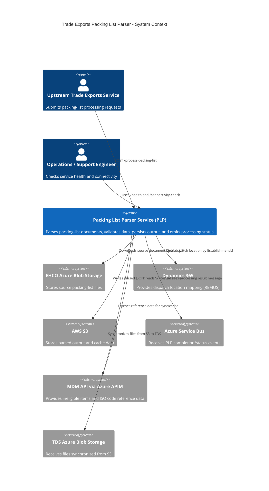

# C4 System Context - Trade Exports Packing List Parser

This diagram is derived from the current `src/` implementation and shows the PLP service boundary, primary actors, and external systems.

## Notes

- Production routes indicate primary inbound API access via `POST /process-packing-list`.
- Connectivity and test routes show explicit dependencies on Dynamics, S3, EHCO Blob, TDS Blob, MDM, and Service Bus.
- Startup and scheduler code show background sync flows for MDM -> S3 and S3 -> TDS.

---

## External Service Interactions

### EHCO Azure Blob Storage

PLP downloads the source packing-list document from EHCO Azure Blob Storage during request processing. The `packing_list_blob` URI supplied in the inbound `POST /process-packing-list` payload identifies the container and blob to retrieve. The file is downloaded as a raw buffer and, where the format is Excel or CSV, converted to JSON before parsing begins. A connectivity-check endpoint (`GET /ehco-blob-forms-container`) verifies that the configured container is reachable.

**Relevant source:** `src/services/blob-storage/ehco-blob-storage-service.js` — `downloadBlobFromApplicationFormsContainerAsJson()`

---

### Dynamics 365

PLP queries Dynamics 365 (REMOS) once per processing request to resolve an establishment identifier into a dispatch location. The `EstablishmentId` is extracted from the inbound payload's `SupplyChainConsignment.DispatchLocation.IDCOMS` field and passed to the Dynamics API. The returned dispatch location is embedded in the final parsed packing-list record.

**Relevant source:** `src/services/dynamics-service.js` — `getDispatchLocation()`

---

### AWS S3

PLP uses S3 for two distinct purposes:

1. **Parsed output persistence** — after a packing list is successfully parsed, the resulting JSON is uploaded to S3 keyed by the `application_id` (e.g. `v0.0/<application_id>.json`). This is the primary durable store of packing-list records.
2. **Reference-data cache files** — ineligible-items and ISO-codes data fetched from MDM are written to S3 so they survive service restarts. Cache files live under a configurable schema prefix (default: `cache/`). On startup the service reads these files to warm its in-memory caches. The TDS sync process also reads and then deletes packing-list JSON files from S3 after transferring them to TDS.

**Relevant source:** `src/services/s3-service.js` — `uploadJsonFileToS3()`, `listS3Objects()`, `getStreamFromS3()`, `deleteFileFromS3()`

---

### Azure Service Bus

After a packing list is parsed and persisted, PLP publishes a processing-result message to an Azure Service Bus queue. The message body contains the `applicationId`, an `approvalStatus` (derived from validation outcomes), and any `failureReasons`. Top-level metadata fields (`type`, `source`, `subject`, `contentType`, and `applicationProperties`) conform to the Trade Platform messaging contract. Messages are only dispatched when a parser match is found — `NOMATCH` results and requests made with `stopDataExit=true` are silently skipped.

**Relevant source:** `src/services/trade-service-bus-service.js` — `sendMessageToQueue()`; `src/services/packing-list-process-service.js` — `createServiceBusMessage()`

---

### MDM API (via Azure APIM)

PLP fetches two reference datasets from the MDM API on a scheduled basis (default: hourly cron `0 * * * *`):

- **Ineligible items** — a list of commodity codes and country-of-origin combinations that are prohibited. Retrieved via `GET <internalAPIMEndpoint><getIneligibleItemsEndpoint>` and cached in memory and in S3.
- **ISO country codes** — used to validate country-of-origin values in packing-list rows. Retrieved via `GET <internalAPIMEndpoint><getIsoCodesEndpoint>` and cached in memory and in S3.

Both datasets are fetched through Azure API Management using Defra tenant credentials. If MDM integration is disabled (`MDM_INTEGRATION_ENABLED=false`) the schedulers skip execution and the service falls back to the bundled static JSON data files.

**Relevant source:** `src/services/mdm-service.js` — `getIneligibleItems()`, `getIsoCodes()`; `src/services/cache/` — sync and scheduler modules

---

### TDS Azure Blob Storage

PLP synchronises parsed packing-list JSON files from S3 to TDS Azure Blob Storage on a scheduled basis (default: hourly cron `0 * * * *`). The sync process:

1. Lists all files in the configured S3 schema folder (e.g. `v0.0/`).
2. Downloads each file from S3 as a byte stream.
3. Uploads the file to the TDS container under the configured folder path (`AZURE_TDS_BLOB_FOLDER_PATH`), using `application/json` content type for `.json` files.
4. Deletes the file from S3 only after a successful upload.

Files are processed in parallel batches (default batch size: 5) to prevent resource exhaustion. Individual file failures do not abort the batch; failed files remain in S3 and are retried on the next scheduled run. The sync can be disabled via `TDS_SYNC_ENABLED=false`.

**Relevant source:** `src/services/tds-sync/tds-sync.js` — `syncToTds()`; `src/services/blob-storage/tds-blob-storage-service.js` — `uploadToTdsBlob()`
