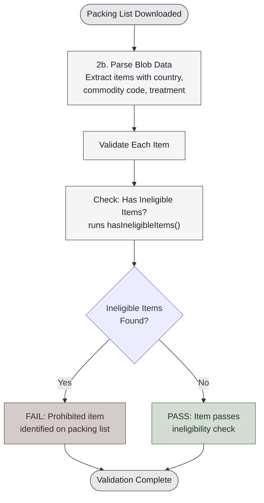
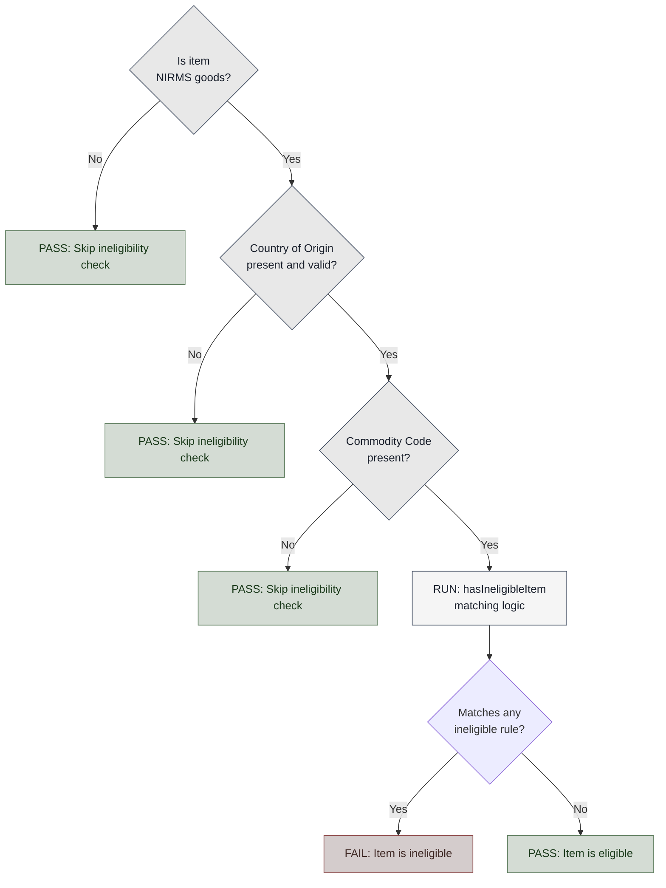
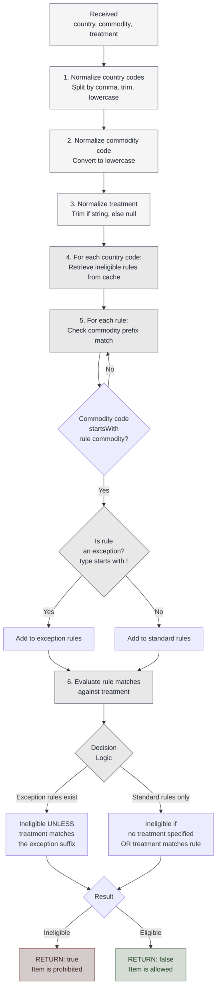
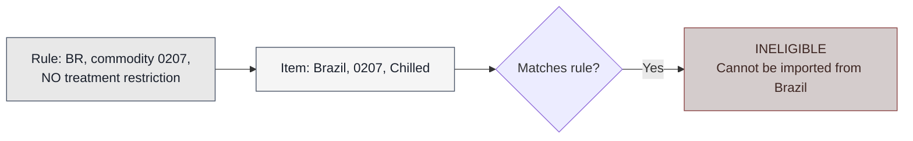
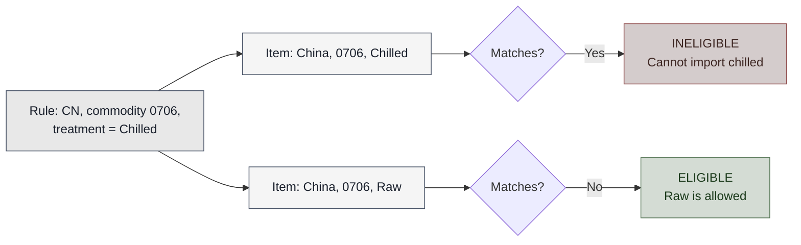
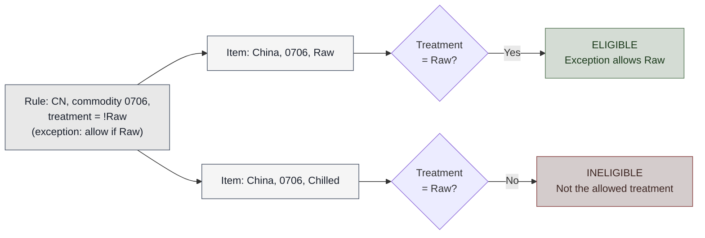

# Ineligible Items Identification

This document describes how the packing list parser identifies prohibited (ineligible) items during validation. Understanding this process is essential for developers implementing parsers and validators that integrate with the trade exports workflow.

## Overview

**Ineligible items** are goods that are prohibited from export and cannot be included in a valid packing list. The system identifies these items using three core data points from each packing list row:

1. **Country of Origin** — Where the goods originate (ISO 2-letter code, can be comma-separated)
2. **Commodity Code** — Product classification code (numeric, checked with prefix matching)
3. **Type of Treatment** — Processing or storage method applied to the goods (optional)

The identification process validates that only **NIRMS goods** (Northern Ireland Risk and Mitigating Measures) are checked against ineligible rules, then applies business logic to determine if a combination of country, commodity, and treatment is prohibited.

---

## Integration Point in the Processing Flow

The ineligible items check runs as part of the **packing list validation** step, after parsing is complete:



This check occurs during **Step 2b (Parse Blob Data)** in the main processing workflow, before results are persisted.

---

## Decision Tree: When is the Check Applied?

The ineligible items check only applies when **all conditions are met**. Use this decision tree to understand whether an item will be checked:



**Key conditions:**

| Condition             | Check                                                                                            | Skip Check If                                             |
| --------------------- | ------------------------------------------------------------------------------------------------ | --------------------------------------------------------- |
| **NIRMS Goods**       | Is `nirms` field one of: `yes`, `nirms`, `green`, `y`, `g`, or starts with `"green lane"`?       | Not NIRMS (marked `no`, `red`, `n`, `r`, or `"red lane"`) |
| **Country of Origin** | Field must not be null/empty AND must be a valid ISO code or comma-separated list of valid codes | Missing, empty, or invalid ISO codes                      |
| **Commodity Code**    | Field must not be null/empty                                                                     | Missing or empty                                          |

If all three conditions are true, the system runs the ineligible item matching logic.

---

## Matching Logic: Country → Commodity → Treatment

Once a NIRMS item passes the preconditions, the system performs the matching:



---

## Business Rules: Treatment Type Logic

The **type of treatment** field modifies the eligibility decision. There are three rule types:

### **1. Blanket Ban** (`type_of_treatment: null`)

A null treatment means the commodity is **always ineligible** from that country, regardless of how it has been treated.



**Example:** Brazil (BR) cannot export commodity code 0207 (poultry meat) under any circumstances.

### **2. Conditional Ban** (`type_of_treatment: "Chilled"`)

A specified treatment means the commodity is **ineligible only for that treatment**. Items with different treatments may be allowed.



**Example:** China (CN) can export commodity code 0706 (vegetables) but NOT if it is chilled. Raw or frozen versions are permitted.

### **3. Exception Rule** (`type_of_treatment: "!Raw"`)

An exception rule (prefixed with `!`) means the commodity is **normally prohibited, but ALLOWED if** the treatment matches the suffix (removing the `!`).



**Example:** China (CN) normally cannot export commodity code 0706 (vegetables), **except when it is marked as Raw**. Chilled or other treatments are prohibited.

---

## Core Functions

### `hasIneligibleItems(item)`

**Entry point** for the ineligible items check. Called once per packing list item during validation.

**Preconditions checked:**

- Item must be NIRMS goods (`nirms` field matches yes/nirms/green/y/g/green lane pattern)
- Country of origin must be present and valid (ISO code or comma-separated codes)
- Commodity code must be present (non-empty)

**Returns:**

- `true` if all preconditions met AND `isIneligibleItem()` returns true
- `false` otherwise

**Example:**

```javascript
hasIneligibleItems({
  nirms: 'yes',
  country_of_origin: 'BR',
  commodity_code: '0207',
  type_of_treatment: null
})
// Returns: true (Brazil + 0207 is a blanket ban)

hasIneligibleItems({
  nirms: 'no', // Not NIRMS goods
  country_of_origin: 'BR',
  commodity_code: '0207'
})
// Returns: false (precondition fails: not NIRMS)
```

### `isIneligibleItem(countryOfOrigin, commodityCode, typeOfTreatment)`

**Core matching logic**. Performs country-commodity-treatment matching against ineligible rules.

**Parameters:**

- `countryOfOrigin` (string) — ISO code or comma-separated codes (e.g., `"BR"`, `"BR,CN"`)
- `commodityCode` (string) — Numeric commodity code (e.g., `"0207"`)
- `typeOfTreatment` (string|null) — Optional treatment type (e.g., `"Chilled"`, `"Raw"`, `null`)

**Returns:**

- `true` if the item matches any ineligible rule (based on treatment logic)
- `false` if no rules match or the item is allowed by an exception

**Example:**

```javascript
// Blanket ban: always ineligible
isIneligibleItem('BR', '0207', null)
// Returns: true

// Conditional ban: ineligible for matched treatment only
isIneligibleItem('CN', '0706', 'Chilled')
// Returns: true (Chilled not allowed)

isIneligibleItem('CN', '0706', 'Raw')
// Returns: false (Raw is allowed)

// Exception rule: whitelist specific treatment
isIneligibleItem('CN', '0706', 'Raw') // (if rule = !Raw)
// Returns: false (exception allows Raw)

isIneligibleItem('CN', '0706', 'Frozen') // (if rule = !Raw)
// Returns: true (Frozen not in exception)
```

---

## Data Source: Ineligible Rules

Ineligible rules are stored as objects with three fields:

```json
{
  "country_of_origin": "BR",
  "commodity_code": "0207",
  "type_of_treatment": null
}
```

**Rule storage:**

- **Primary:** Cached index in memory, organized by country for O(1) lookups
- **Cache source:** S3 (refreshed hourly if MDM integration enabled)
- **Fallback:** Static JSON file with ~2000+ rules

**Rule matching:**

- Commodity codes use **prefix matching** (`startsWith`), so rule `"0207"` matches items `"0207"`, `"02070"`, `"020700"`, etc.
- Country codes are **exact match** after normalization
- Treatment is **case-insensitive exact match** (after trimming)

---

## Worked Examples

### Example 1: Blanket Ban (Brazil Poultry)

**Rule in system:**

```json
{
  "country_of_origin": "br",
  "commodity_code": "0207",
  "type_of_treatment": null
}
```

**Packing list item:**
| Field | Value |
|-------|-------|
| nirms | yes |
| country_of_origin | BR |
| commodity_code | 0207 |
| type_of_treatment | Chilled |
| description | Poultry breast |

**Validation process:**

1. `hasIneligibleItems()` checks preconditions:
   - ✓ NIRMS goods (yes)
   - ✓ Country valid (BR is ISO code)
   - ✓ Commodity present (0207)
2. Call `isIneligibleItem('BR', '0207', 'Chilled')`
3. Normalize country: `'br'`
4. Retrieve rules for `'br'`: finds rule with commodity `'0207'`, treatment `null`
5. Check: `'0207'.startsWith('0207')` → **YES, match found**
6. Categorize: treatment is `null` (not exception) → standard rule
7. Evaluate: standard rule with `null` treatment → **always ineligible**
8. **Result: FAIL** — "Prohibited item identified on the packing list"

---

### Example 2: Conditional Ban (China Vegetables, Chilled)

**Rule in system:**

```json
{
  "country_of_origin": "cn",
  "commodity_code": "0706",
  "type_of_treatment": "Chilled"
}
```

**Packing list item (Chilled variant):**
| Field | Value |
|-------|-------|
| nirms | yes |
| country_of_origin | CN |
| commodity_code | 0706 |
| type_of_treatment | Chilled |
| description | Chilled vegetables |

**Validation process:**

1. `hasIneligibleItems()` preconditions: **all pass**
2. Call `isIneligibleItem('CN', '0706', 'Chilled')`
3. Normalize: country `'cn'`, commodity `'0706'`, treatment `'Chilled'` (trimmed)
4. Retrieve rules for `'cn'`: finds rule with commodity `'0706'`, treatment `'Chilled'`
5. Match: `'0706'.startsWith('0706')` → **YES**
6. Evaluate: standard rule with treatment `'Chilled'` matches item treatment → **ineligible**
7. **Result: FAIL**

---

**Same rule, Raw variant (different treatment):**
| Field | Value |
|-------|-------|
| nirms | yes |
| country_of_origin | CN |
| commodity_code | 0706 |
| type_of_treatment | Raw |
| description | Raw vegetables |

**Validation process (step 6 differs):** 6. Evaluate: standard rule specifies `'Chilled'`, but item treatment is `'Raw'` → **no match → eligible** 7. **Result: PASS**

---

### Example 3: Exception Rule (China Vegetables, Except Raw)

**Rule in system:**

```json
{
  "country_of_origin": "cn",
  "commodity_code": "0706",
  "type_of_treatment": "!Raw"
}
```

This rule means: "China + 0706 is normally prohibited, **except when Raw**."

**Packing list item (Raw variant):**
| Field | Value |
|-------|-------|
| nirms | yes |
| country_of_origin | CN |
| commodity_code | 0706 |
| type_of_treatment | Raw |
| description | Raw vegetables |

**Validation process:**

1. Preconditions: **all pass**
2. Call `isIneligibleItem('CN', '0706', 'Raw')`
3. Normalize: country `'cn'`, commodity `'0706'`, treatment `'Raw'`
4. Retrieve rules for `'cn'`: finds rule with commodity `'0706'`, treatment `'!Raw'`
5. Match: `'0706'.startsWith('0706')` → **YES, rule matched**
6. Categorize: treatment `'!Raw'` starts with `!` → **exception rule**
7. Evaluate exception: extract suffix `'Raw'` from `'!Raw'`, compare with item treatment `'Raw'` → **match**
8. Exception rule matched → item is **ALLOWED**
9. **Result: PASS**

---

**Same rule, Chilled variant:**
| Field | Value |
|-------|-------|
| nirms | yes |
| country_of_origin | CN |
| commodity_code | 0706 |
| type_of_treatment | Chilled |
| description | Chilled vegetables |

**Validation (step 7 differs):** 7. Evaluate exception: suffix is `'Raw'`, item treatment is `'Chilled'` → **no match** 8. Exception rule NOT matched → item is **PROHIBITED** 9. **Result: FAIL**

---

## Key Takeaways for Implementers

1. **Only NIRMS items are checked** — Non-NIRMS goods skip the ineligibility check entirely.

2. **Commodity prefix matching** — A rule for `"0207"` catches `"020700"`, `"0207001"`, etc. Ensure parsers normalize codes to numeric strings.

3. **Treatment values must be exact** — Case is ignored, but spacing matters. Trim treatment data from parsers to avoid mismatches.

4. **Exception rules use the `!` prefix** — Developers adding rules should use `"!Treatment"` to create a whitelist exception.

5. **Country codes can be comma-separated** — Handle multi-origin items like `"BR,CN"` by checking each country independently.

6. **Rule data comes from cache** — The ineligible items are loaded from S3 or static fallback on startup. For testing, verify the cache is initialized before running packing list validation.
