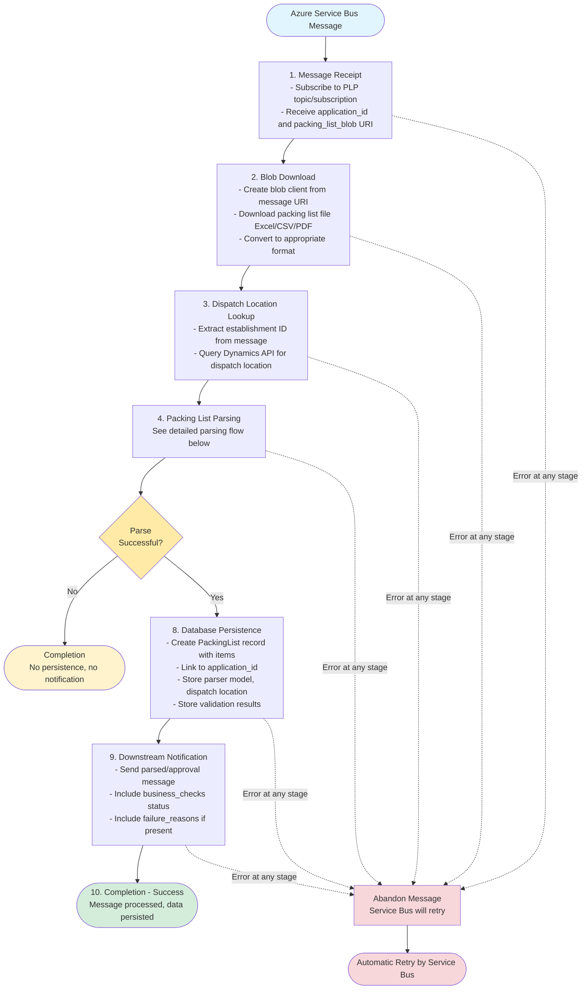
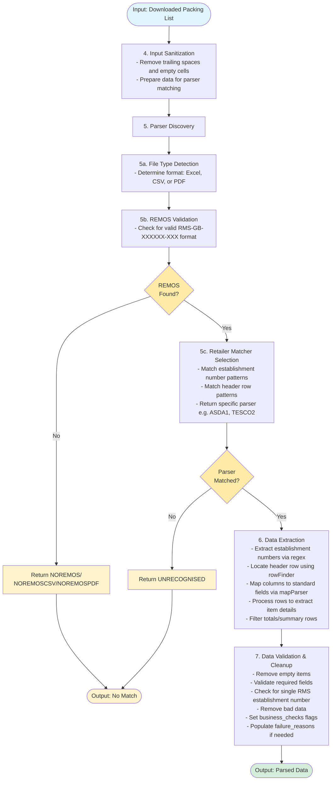

# Packing List Processing Flow

## High-Level Overview

This document describes the complete process for parsing packing lists from when a message is received from the Azure Service Bus through to completion.

## Processing Pipeline

## Detailed Parsing Flow (Steps 4-7)

## Detailed Stage Descriptions

### 1. Message Receipt

The service subscribes to an Azure Service Bus topic/subscription to receive incoming packing list processing requests. Each message contains:

- `application_id`: Unique identifier for the export application
- `packing_list_blob`: Azure Blob Storage URI pointing to the uploaded packing list file
- `SupplyChainConsignment.DispatchLocation.IDCOMS.EstablishmentId`: Establishment identifier

**Entry Point:** `app/messaging/index.js` - `start()` function

### 2. Blob Download

Using the blob URI from the message, the service:

- Creates an Azure Blob Storage client
- Downloads the packing list file (Excel, CSV, or PDF format)
- Converts Excel/CSV files to JSON format using appropriate utilities
- Keeps PDF files as Buffer objects for processing

**Implementation:**

- `app/services/storage-account.js` - `createStorageAccountClient()`, `getPackingListFromBlob()`
- `app/utilities/excel-utility.js` - Excel to JSON conversion
- `app/utilities/csv-utility.js` - CSV to JSON conversion

### 3. Dispatch Location Lookup

The establishment ID from the message is used to query the Dynamics API to retrieve the dispatch location number. This information is required for the final packing list record.

**Implementation:** `app/services/dynamics-service.js` - `getDispatchLocation()`

### 4-7. Packing List Parsing

The parsing process (steps 4-7) is detailed in the separate diagram above. This encompasses input sanitization, parser discovery, data extraction, and validation. See individual subsections below for details.

### 4. Input Sanitization

For Excel and CSV files, the data is sanitized to:

- Remove trailing whitespace from cell values
- Filter out empty cells and rows
- Ensure consistent data structure for parser matching

PDF files pass through unchanged as they require different processing.

**Implementation:**

- `app/services/parser-service.js` - `sanitizeInput()`
- `app/utilities/json-file.js` - `sanitise()`

### 5. Parser Discovery

#### 5a. File Type Detection

The file extension determines the initial parser category:

- `.xlsx`, `.xls` → Excel parsers
- `.csv` → CSV parsers
- `.pdf` → PDF parsers (AI or non-AI)

**Implementation:** `app/services/parsers/parser-factory.js` - `findParser()`

#### 5b. REMOS Validation

Before attempting retailer-specific matching, the document is scanned for valid REMOS (RMS establishment numbers) in the format `RMS-GB-XXXXXX-XXX`. If no valid REMOS is found, the parser returns:

- `NOREMOS` (Excel)
- `NOREMOSCSV` (CSV)
- `NOREMOSPDF` (PDF)

**Implementation:**

- `app/services/parsers/no-match/` - REMOS validator parsers
- Regex pattern: `/^RMS-GB-\d{6}-\d{3}$/i`

#### 5c. Retailer Matcher Selection

Using the establishment number and header patterns, the service identifies the specific retailer format:

1. Extract establishment number using regex patterns
2. Match against known retailer establishment number patterns (e.g., ASDA, Tesco, Co-op)
3. Validate header row structure matches expected format for that retailer
4. Return the matched parser (e.g., `ASDA1`, `TESCO2`, `COOP1`)

If no match is found, returns `UNRECOGNISED`.

**Implementation:**

- `app/services/parsers/parsers.js` - `getExcelParser()`, `getCsvParser()`, `getPdfParser()`
- `app/services/model-headers.js` - Retailer header definitions
- `app/services/matchers/` - Retailer-specific matchers

### 6. Data Extraction

Once the correct parser is identified, it extracts structured data from the packing list:

1. Extract all establishment numbers from the document
2. Locate the header row using `rowFinder` utilities
3. Map column positions to standard field names using `mapParser()`
4. Iterate through data rows and extract item information
5. Filter out totals and summary rows
6. Extract standard fields for each item:
   - `description`: Product description
   - `commodity_code`: Harmonized System code
   - `number_of_packages`: Package count
   - `total_net_weight_kg`: Net weight in kilograms
   - `country_of_origin`: Origin country code
   - `row_location`: Source row reference

**Implementation:**

- `app/services/parsers/[retailer]/` - Retailer-specific parser implementations
- `app/services/parser-map.js` - Column mapping utility
- `app/utilities/row-finder.js` - Header row detection

### 7. Data Validation & Cleanup

The extracted data undergoes validation and cleanup:

**Cleanup:**

- Remove items with all null/undefined values
- Filter items with invalid or missing critical data

**Validation:**

- Check all required fields are present
- Verify single RMS establishment number
- Validate data formats (weights, codes, etc.)
- Set `business_checks.all_required_fields_present` flag
- Populate `business_checks.failure_reasons` array with any issues

**Implementation:**

- `app/services/parsers/parser-factory.js` - `generateParsedPackingList()`
- `app/services/validators/packing-list-column-validator.js` - Field validation
- `app/services/validators/packing-list-validator-utilities.js` - Cleanup utilities

---

## Main Flow Continuation

### 8. Database Persistence

If a parser successfully matched the document (not `NOMATCH`), the parsed data is saved to the database:

- Create `PackingList` record linked to the `application_id`
- Store all extracted items as related records
- Save parser model, dispatch location, and validation results
- Record timestamps and processing metadata

**Implementation:**

- `app/packing-list/index.js` - `createPackingList()`
- `app/models/packing-list.js` - PackingList model
- `app/models/item.js` - Item model

### 9. Downstream Notification

For successfully matched documents, the service sends a parsed/approval message to downstream services:

- Message includes `application_id`
- Includes `business_checks.all_required_fields_present` status
- Includes `failure_reasons` if validation issues were found
- Enables downstream approval workflow to proceed

**Implementation:** `app/messaging/send-parsed-message.js` - `sendParsed()`

### 10. Completion

The process completes in one of two ways:

**Success:**

- Message has been processed
- Data persisted to database (if matched)
- Downstream notification sent (if matched)
- Logs indicate successful completion

**Failure:**

- Any exception during processing triggers message abandonment
- Service Bus will automatically retry the message
- Error is logged with context for investigation

**Implementation:** `app/messaging/process-plp-message.js` - exception handling

## Parser Result Types

| Result Type      | Description                                             | Action Taken                           |
| ---------------- | ------------------------------------------------------- | -------------------------------------- |
| **MATCHED**      | Retailer format identified, data extracted successfully | Persist to database, send notification |
| **NOREMOS**      | No valid RMS establishment number found in Excel file   | No persistence, no notification        |
| **NOREMOSCSV**   | No valid RMS establishment number found in CSV file     | No persistence, no notification        |
| **NOREMOSPDF**   | No valid RMS establishment number found in PDF file     | No persistence, no notification        |
| **UNRECOGNISED** | File format not supported or header structure unknown   | No persistence, no notification        |
| **NOMATCH**      | Generic catch-all for unmatched documents               | No persistence, no notification        |

## Error Handling Strategy

The service implements a robust error handling approach:

1. **Immediate Acknowledgment**: Messages are completed immediately to prevent blocking the queue
2. **Comprehensive Logging**: All errors logged with module name, function name, and context
3. **Graceful Degradation**: Parsers return `NOMATCH` rather than throwing exceptions
4. **Automatic Retry**: Failed messages are abandoned and automatically retried by Service Bus
5. **Isolation**: Errors in one stage don't cascade to others

## Key Implementation Files

| Component          | File Path                                          |
| ------------------ | -------------------------------------------------- |
| Message Bootstrap  | `app/messaging/index.js`                           |
| Message Processing | `app/messaging/process-plp-message.js`             |
| Parser Service     | `app/services/parser-service.js`                   |
| Parser Factory     | `app/services/parsers/parser-factory.js`           |
| Parser Selection   | `app/services/parsers/parsers.js`                  |
| Model Headers      | `app/services/model-headers.js`                    |
| Parser Mapping     | `app/services/parser-map.js`                       |
| Matchers           | `app/services/matchers/[retailer]/`                |
| Parsers            | `app/services/parsers/[retailer]/`                 |
| Validators         | `app/services/validators/`                         |
| Storage Account    | `app/services/storage-account.js`                  |
| Dynamics Service   | `app/services/dynamics-service.js`                 |
| Database Models    | `app/models/packing-list.js`, `app/models/item.js` |

## Supported Retailers

The service currently supports parsers for the following retailers (see `app/services/matchers/` and `app/services/parsers/` for complete list):

- ASDA
- Boots
- Booker
- Buffalo-ad Logistics
- CDS
- Co-op
- Davenport
- Fowler Welch
- Giovanni
- Greggs
- Iceland
- Kepak
- Marks & Spencer
- Mars
- Nisa
- Nutricia
- Sainsbury's
- Savers
- Tesco
- TJ Morris
- Turners
- Warrens
- B&M (BANDM)

Each retailer may have multiple format variants (e.g., ASDA1, ASDA2) to handle different packing list templates.

## Testing

For information on testing the packing list processing flow, see:

- Unit tests: `test/unit/services/parser-service/`
- Integration tests: `test/integration/`
- QA regression tests: `make qa-test` (see README.md)
