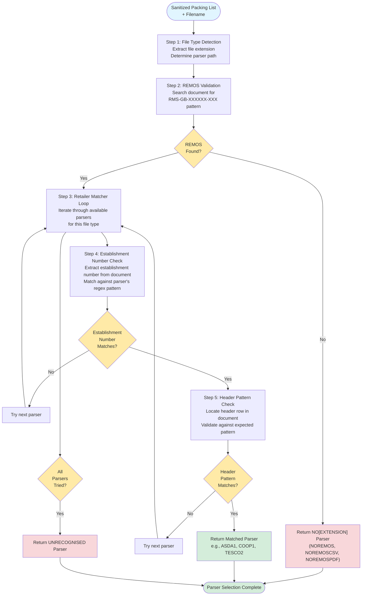

# Finding the Right Parser - Generic Process

## Overview

This document describes the generic process for identifying which parser should be used to extract data from a packing list file. The process is consistent across all file types (Excel, CSV, and PDF), with only the specific implementation files and functions varying by format.

## High-Level Process Flow



## Process Description

### Step 1: File Type Detection

The process begins by examining the file extension to determine which category of parsers to search through.

**What happens:**

- Extract file extension from filename (`.xlsx`, `.xls`, `.csv`, or `.pdf`)
- Route to appropriate parser collection (Excel parsers, CSV parsers, or PDF parsers)
- Initialize the parser discovery process for that file type

**Purpose:** This early classification ensures we only search through relevant parsers, improving performance and reducing false matches.

---

### Step 2: REMOS Validation

Before attempting to match specific retailer formats, the document is validated to ensure it contains at least one valid REMOS (RMS establishment number).

**What happens:**

- Scan the entire document for the pattern `RMS-GB-XXXXXX-XXX` (where X is a digit)
- Use regex matching to identify valid REMOS format
- If no valid REMOS is found, immediately return a "no REMOS" parser result

**Purpose:** REMOS validation acts as a fast-fail mechanism. Packing lists for UK export must contain RMS establishment numbers, so documents without them cannot be processed and should be rejected early.

**Result codes:**

- **NOREMOS** - Excel file with no valid RMS establishment number
- **NOREMOSCSV** - CSV file with no valid RMS establishment number
- **NOREMOSPDF** - PDF file with no valid RMS establishment number

---

### Step 3: Retailer Matcher Loop

Once a REMOS is confirmed, the system iterates through all available parsers for the detected file type.

**What happens:**

- Retrieve the collection of parsers for this file type (e.g., all Excel parsers)
- Loop through each parser definition sequentially
- For each parser, attempt the establishment number and header pattern checks

**Purpose:** Different retailers use different packing list templates. This loop systematically checks each known template until a match is found.

---

### Step 4: Establishment Number Check

Each parser defines a regex pattern for the establishment numbers it expects to find in documents.

**What happens:**

- Extract the establishment number from the document using the parser's specific extraction method
- Compare against the parser's expected establishment number regex pattern
- If the pattern matches, proceed to header validation
- If no match, skip to the next parser in the loop

**Purpose:** Establishment numbers often indicate which retailer/supplier created the document. This acts as a first-level filter before the more expensive header pattern matching.

**Example patterns:**

- ASDA establishment numbers might follow pattern: `^8000.*$`
- Tesco establishment numbers might follow pattern: `^3663.*$`
- Co-op establishment numbers might follow pattern: `^2150.*$`

---

### Step 5: Header Pattern Check

If the establishment number matches, the system validates the document's header structure against the expected pattern.

**What happens:**

- Locate the header row in the document (row containing column titles like "Description", "Weight", etc.)
- Extract the header values (column names/titles)
- Use the matcher's `matches()` function to validate the header structure
- Check for expected columns, order, and text patterns
- Return `matcherResult.CORRECT` if headers match the expected structure

**Purpose:** This is the definitive validation step. Header patterns are highly specific to each retailer's template format, making them the most reliable indicator of which parser to use.

**What's validated:**

- Presence of required columns (description, commodity code, weight, etc.)
- Column order and positioning
- Specific text patterns in column headers
- Case sensitivity and spacing (depending on parser configuration)

---

### Results

The parser discovery process returns one of the following:

| Result Type                       | Description                                      | Next Action                                  |
| --------------------------------- | ------------------------------------------------ | -------------------------------------------- |
| **Matched Parser**                | Specific parser identified (e.g., ASDA1, TESCO2) | Proceed to data extraction using this parser |
| **NOREMOS/NOREMOSCSV/NOREMOSPDF** | No valid RMS establishment number found          | Reject document - no further processing      |
| **UNRECOGNISED**                  | Has REMOS but no parser matched                  | Reject document - format not supported       |

---

## Implementation by File Type

### Excel Files (.xlsx, .xls)

#### File Type Detection

**File:** `app/utilities/file-extension.js`

- Extracts extension from filename
- Returns `'excel'` for `.xlsx` and `.xls` files

#### Parser Collection

**File:** `app/services/parsers/parsers.js`
**Function:** `getExcelParser(packingList, filename)`

- Entry point for Excel parser discovery
- Manages the iteration through Excel parsers

#### REMOS Validation

**File:** `app/services/parsers/no-match/NOREMOS.js`
**Function:** `matches(packingList)`

- Scans Excel JSON structure for RMS-GB-XXXXXX-XXX pattern
- Returns `true` if no REMOS found (indicating this is a "no match" case)

#### Model Headers Configuration

**File:** `app/services/model-headers.js`

- Contains establishment number regex patterns for each Excel parser
- Defines header structure expectations
- Format:
  ```javascript
  {
    parserName: 'ASDA1',
    establishmentNumber: {
      regex: /^8000.*$/
    },
    headers: [/* header definitions */]
  }
  ```

#### Retailer Matchers

**Files:** `app/services/matchers/[retailer]/model*.js`
**Function:** `matches(packingList)`

- Each retailer has one or more matcher files (e.g., `modelAsdaOne.js`, `modelCoopOne.js`)
- Implements establishment number extraction
- Implements header row validation
- Returns `matcherResult.CORRECT`, `matcherResult.INCORRECT`, or `matcherResult.HEADERNOTFOUND`

**Example matchers:**

- `app/services/matchers/asda/modelAsdaOne.js` - ASDA format 1
- `app/services/matchers/asda/modelAsdaTwo.js` - ASDA format 2
- `app/services/matchers/coop/modelCoopOne.js` - Co-op format
- `app/services/matchers/tesco/modelTescoTwo.js` - Tesco format 2

---

### CSV Files (.csv)

#### File Type Detection

**File:** `app/utilities/file-extension.js`

- Extracts extension from filename
- Returns `'csv'` for `.csv` files

#### Parser Collection

**File:** `app/services/parsers/parsers.js`
**Function:** `getCsvParser(packingList, filename)`

- Entry point for CSV parser discovery
- Manages the iteration through CSV parsers

#### REMOS Validation

**File:** `app/services/parsers/no-match/NOREMOSCSV.js`
**Function:** `matches(packingList)`

- Scans CSV JSON structure for RMS-GB-XXXXXX-XXX pattern
- Returns `true` if no REMOS found

#### Model Headers Configuration

**File:** `app/services/model-headers-csv.js`

- Contains establishment number regex patterns for each CSV parser
- Defines header structure expectations
- Same structure as Excel model headers

#### Retailer Matchers

**Files:** `app/services/matchers/[retailer]/model*.js`

- Same matcher files used as Excel, but called via CSV parser path
- CSV data is typically converted to same JSON structure as Excel before matching

---

### PDF Files (.pdf)

#### File Type Detection

**File:** `app/utilities/file-extension.js`

- Extracts extension from filename
- Returns `'pdf'` for `.pdf` files

#### Parser Collection

**File:** `app/services/parsers/parsers.js`
**Function:** `getPdfParser(packingList, filename)` or `getPdfNonAiParser(packingList, filename)`

- Entry point for PDF parser discovery
- Two variants: AI-powered and non-AI parsers
- Manages the iteration through PDF parsers

#### REMOS Validation

**File:** `app/services/parsers/no-match/NOREMOSPDF.js`
**Function:** `matches(packingList)`

- Scans PDF text/structure for RMS-GB-XXXXXX-XXX pattern
- Returns `true` if no REMOS found

#### Model Headers Configuration

**File:** `app/services/model-headers-pdf.js`

- Contains establishment number regex patterns for each PDF parser
- Defines expected text patterns and structure
- May differ from Excel/CSV due to PDF text extraction quirks

#### Retailer Matchers

**Files:** `app/services/matchers/[retailer]/model*Pdf.js`

- PDF-specific matcher implementations
- Account for PDF text extraction challenges
- May use different matching strategies than Excel/CSV

**Example PDF matchers:**

- `app/services/matchers/asda/modelAsdaOnePdf.js`
- `app/services/matchers/boots/modelBootsPdf.js`

---

## Common Utilities

The following utilities are used across all file types:

### Regex Utilities

**File:** `app/utilities/regex.js`
**Functions:**

- `findMatch(text, regex)` - Find first regex match in text
- `findAllMatches(text, regex)` - Find all regex matches in text

**Used for:** Extracting establishment numbers and REMOS patterns

### Row Finder Utilities

**File:** `app/utilities/row-finder.js`
**Function:** `rowFinder(data, headerCallback)`

**Used for:** Locating the header row in Excel/CSV data structures

### Header Matching

**File:** `app/services/matches-header.js`
**Function:** `matchesHeader(headers, expectedHeaders)`

**Used for:** Validating header patterns against expected structure

---

## Parser Result Objects

All parser discovery methods return a parser object with the following structure:

```javascript
{
  parserModel: 'ASDA1',          // Parser identifier
  type: 'excel',                  // File type
  parse: function(data) { },      // Parse function to extract data
  matches: function(data) { }     // Matcher function (reference)
}
```

For "no match" cases:

```javascript
{
  parserModel: 'NOREMOS',         // Or NOREMOSCSV, NOREMOSPDF, UNRECOGNISED
  type: 'excel',
  parse: function(data) { }       // Returns empty/error structure
}
```

---

## Key Takeaways

1. **Consistent Process:** The same 5-step process applies to all file types, only implementation details vary
2. **Fast Fail:** REMOS validation acts as an early rejection mechanism
3. **Sequential Matching:** Parsers are tried one-by-one until a match is found
4. **Two-Level Validation:** Both establishment number and header pattern must match
5. **Extensible:** New parsers can be added by creating new matcher files and updating model headers
6. **Specific Implementations:** Each file type has its own matcher files and configuration to account for format-specific quirks

---

## Adding a New Parser

To add support for a new retailer format:

1. **Create matcher file:** `app/services/matchers/[retailer]/model[Name].js`
2. **Implement `matches()` function:** Extract establishment number and validate headers
3. **Add to model headers:** Update `app/services/model-headers.js` (or CSV/PDF variants)
4. **Define establishment regex:** Specify the pattern to match
5. **Define header structure:** List expected columns and patterns
6. **Create parser:** Implement corresponding parser in `app/services/parsers/[retailer]/`
7. **Test:** Verify with sample packing lists

The system will automatically include the new parser in the discovery loop.
