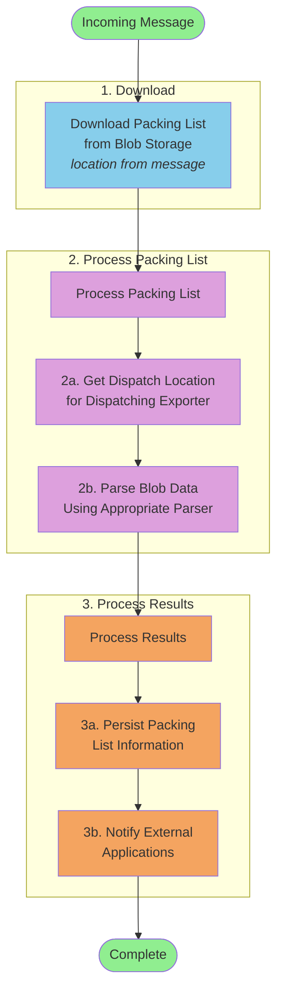

# Packing List Processing Sequence

This diagram shows the detailed sequence of steps for processing an incoming packing list message.

## Detailed Process Steps

### Step 1: Download

**Download Packing List from Blob Storage**

- Receives incoming message with blob location
- Downloads the packing list file from Azure Blob Storage
- Prepares data for processing

### Step 2: Process Packing List

**2a. Get Dispatch Location for Dispatching Exporter**

- Queries Dynamics 365 or MDM service
- Retrieves establishment/dispatch location information
- Associates exporter data with the packing list

**2b. Parse Blob Data Using Appropriate Parser**

- Identifies the packing list format (Excel, CSV, PDF)
- Selects appropriate parser (Savers, Iceland, etc.)
- Extracts structured data from the packing list
- Validates required fields and business rules

### Step 3: Process Results

**3a. Persist Packing List Information**

- Saves parsed data to database/storage
- Records validation results
- Stores metadata and audit information

**3b. Notify External Applications**

- Sends completion notification via Service Bus
- Includes parsing status (success/failure)
- Triggers downstream workflows
- Enables external systems to react to new data

## Integration Points

- **Azure Blob Storage**: Source of packing list files
- **Dynamics 365/MDM**: Dispatch location lookup
- **Parser Service**: Format detection and data extraction
- **Database**: Persistence layer
- **Service Bus**: Notification mechanism
