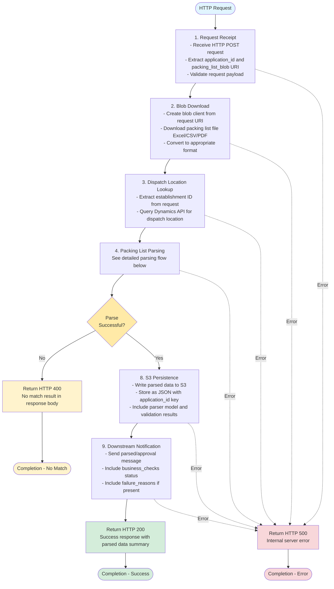

# Packing List Processing Flow (CDP To-Be)

## High-Level Overview

This document describes the complete process for parsing packing lists from when an HTTP request is received through to completion.

## Processing Pipeline



## Detailed Parsing Flow (Steps 4-7)


## Detailed Stage Descriptions

### 1. Request Receipt

The service receives an HTTP POST request containing the packing list processing request. Each request contains:

- `application_id`: Unique identifier for the export application
- `packing_list_blob`: Blob Storage URI pointing to the uploaded packing list file
- `SupplyChainConsignment.DispatchLocation.IDCOMS.EstablishmentId`: Establishment identifier

The request payload is validated before processing begins.

**Entry Point:** `src/routes/packing-list-process.js` - HTTP route handler

### 2. Blob Download

Using the blob URI from the request, the service:

- Creates a Blob Storage client
- Downloads the packing list file (Excel, CSV, or PDF format)
- Converts Excel/CSV files to JSON format using appropriate utilities
- Keeps PDF files as Buffer objects for processing

**Implementation:**

- `src/services/ehco-blob-storage-service.js` - `createStorageAccountClient()`, `getPackingListFromBlob()`
- Excel to JSON conversion utilities
- CSV to JSON conversion utilities

### 3. Dispatch Location Lookup

The establishment ID from the request is used to query the Dynamics API to retrieve the dispatch location number. This information is required for the final packing list record.

**Implementation:** `src/services/dynamics-service.js` - `getDispatchLocation()`

### 4-7. Packing List Parsing

The parsing process (steps 4-7) is detailed in the separate diagram above. This encompasses input sanitization, parser discovery, data extraction, and validation. See individual subsections below for details.

### 4. Input Sanitization

For Excel and CSV files, the data is sanitized to:

- Remove trailing whitespace from cell values
- Filter out empty cells and rows
- Ensure consistent data structure for parser matching

PDF files pass through unchanged as they require different processing.

**Implementation:**

- `src/services/packing-list-process-service.js` - `sanitizeInput()`
- JSON sanitization utilities

### 5. Parser Discovery

#### 5a. File Type Detection

The file extension determines the initial parser category:

- `.xlsx`, `.xls` → Excel parsers
- `.csv` → CSV parsers
- `.pdf` → PDF parsers (AI or non-AI)

**Implementation:** `src/services/parsers/parser-factory.js` - `findParser()`

#### 5b. REMOS Validation

Before attempting retailer-specific matching, the document is scanned for valid REMOS (RMS establishment numbers) in the format `RMS-GB-XXXXXX-XXX`. If no valid REMOS is found, the parser returns:

- `NOREMOS` (Excel)
- `NOREMOSCSV` (CSV)
- `NOREMOSPDF` (PDF)

**Implementation:**

- `src/services/parsers/no-match/` - REMOS validator parsers
- Regex pattern: `/^RMS-GB-\d{6}-\d{3}$/i`

#### 5c. Retailer Matcher Selection

Using the establishment number and header patterns, the service identifies the specific retailer format:

1. Extract establishment number using regex patterns
2. Match against known retailer establishment number patterns (e.g., ASDA, Tesco, Co-op)
3. Validate header row structure matches expected format for that retailer
4. Return the matched parser (e.g., `ASDA1`, `TESCO2`, `COOP1`)

If no match is found, returns `UNRECOGNISED`.

**Implementation:**

- `src/services/parsers/parsers.js` - `getExcelParser()`, `getCsvParser()`, `getPdfParser()`
- `src/services/model-headers.js` - Retailer header definitions
- `src/services/matchers/` - Retailer-specific matchers

### 6. Data Extraction

Once the correct parser is identified, it extracts structured data from the packing list:

1. Extract all establishment numbers from the document
2. Locate the header row using `rowFinder` utilities
3. Map column positions to standard field names using `mapParser()`
4. Iterate through data rows and extract item information
5. Filter out totals and summary rows
6. Extract standard fields for each item:
   - `description`: Product description
   - `commodity_code`: Harmonized System code
   - `number_of_packages`: Package count
   - `total_net_weight_kg`: Net weight in kilograms
   - `country_of_origin`: Origin country code
   - `row_location`: Source row reference

**Implementation:**

- `src/services/parsers/[retailer]/` - Retailer-specific parser implementations
- `src/services/parser-map.js` - Column mapping utility
- `src/utilities/row-finder.js` - Header row detection

### 7. Data Validation & Cleanup

The extracted data undergoes validation and cleanup:

**Cleanup:**

- Remove items with all null/undefined values
- Filter items with invalid or missing critical data

**Validation:**

- Check all required fields are present
- Verify single RMS establishment number
- Validate data formats (weights, codes, etc.)
- Set `business_checks.all_required_fields_present` flag
- Populate `business_checks.failure_reasons` array with any issues

**Implementation:**

- `src/services/parsers/parser-factory.js` - `generateParsedPackingList()`
- `src/services/validators/packing-list-column-validator.js` - Field validation
- `src/services/validators/packing-list-validator-utilities.js` - Cleanup utilities

---

## Main Flow Continuation

### 8. S3 Persistence

If a parser successfully matched the document (not `NOMATCH`), the parsed data is saved to S3:

- Write parsed data as JSON to S3 bucket
- Use `application_id` as the object key (or part of the key structure)
- Include all extracted items in the JSON structure
- Store parser model, dispatch location, and validation results
- Add metadata including timestamps and processing information

**Implementation:**

- `src/services/s3-service.js` - S3 write operations
- JSON structure includes: `application_id`, `items[]`, `parser_model`, `dispatch_location`, `business_checks`, `timestamps`

### 9. Downstream Notification

For successfully matched documents, the service sends a parsed/approval message to downstream services:

- Message includes `application_id`
- Includes `business_checks.all_required_fields_present` status
- Includes `failure_reasons` if validation issues were found
- Enables downstream approval workflow to proceed

**Implementation:** `src/services/trade-service-bus-service.js` - `sendParsed()`

### 10. HTTP Response

The process completes by returning an appropriate HTTP response:

**Success (HTTP 200):**

- Parsed data has been processed and stored
- Response body includes:
  - `application_id`
  - `parser_model` used
  - `item_count`
  - `business_checks` summary
  - `s3_location` where data was stored

**No Match (HTTP 400):**

- Parser could not match the document format
- Response body includes:
  - `application_id`
  - `error`: "No matching parser found"
  - `parser_result`: (NOREMOS, UNRECOGNISED, etc.)
  - No data persisted to S3

**Error (HTTP 500):**

- An exception occurred during processing
- Response body includes:
  - `error`: Error message
  - `application_id` (if available)
  - Error is logged with context for investigation

**Implementation:** `src/routes/packing-list-process.js` - Response handling

## Parser Result Types

| Result Type      | Description                                             | HTTP Status               | Action Taken                                     |
| ---------------- | ------------------------------------------------------- | ------------------------- | ------------------------------------------------ |
| **MATCHED**      | Retailer format identified, data extracted successfully | 200 OK                    | Persist to S3, send notification, return success |
| **NOREMOS**      | No valid RMS establishment number found in Excel file   | 400 Bad Request           | No persistence, no notification, return error    |
| **NOREMOSCSV**   | No valid RMS establishment number found in CSV file     | 400 Bad Request           | No persistence, no notification, return error    |
| **NOREMOSPDF**   | No valid RMS establishment number found in PDF file     | 400 Bad Request           | No persistence, no notification, return error    |
| **UNRECOGNISED** | File format not supported or header structure unknown   | 400 Bad Request           | No persistence, no notification, return error    |
| **NOMATCH**      | Generic catch-all for unmatched documents               | 400 Bad Request           | No persistence, no notification, return error    |
| **ERROR**        | Processing exception occurred                           | 500 Internal Server Error | No persistence, no notification, return error    |

## Error Handling Strategy

The service implements a robust error handling approach:

1. **Request Validation**: Validate request payload before processing begins
2. **Comprehensive Logging**: All errors logged with module name, function name, and context
3. **Graceful Degradation**: Parsers return `NOMATCH` rather than throwing exceptions
4. **HTTP Status Codes**: Appropriate status codes returned for different failure scenarios
5. **Error Details**: Response bodies include helpful error information for clients
6. **Isolation**: Errors in one stage don't cascade to others

## Key Implementation Files

| Component            | File Path                                      |
| -------------------- | ---------------------------------------------- |
| HTTP Route           | `src/routes/packing-list-process.js`           |
| Processing Service   | `src/services/packing-list-process-service.js` |
| Parser Service       | `src/services/parser-service.js`               |
| Parser Factory       | `src/services/parsers/parser-factory.js`       |
| Parser Selection     | `src/services/parsers/parsers.js`              |
| Model Headers        | `src/services/model-headers.js`                |
| Parser Mapping       | `src/services/parser-map.js`                   |
| Matchers             | `src/services/matchers/`                       |
| Parsers              | `src/services/parsers/`                        |
| Validators           | `src/services/validators/`                     |
| Blob Storage Service | `src/services/ehco-blob-storage-service.js`    |
| S3 Service           | `src/services/s3-service.js`                   |
| Dynamics Service     | `src/services/dynamics-service.js`             |
| Service Bus Service  | `src/services/trade-service-bus-service.js`    |

## HTTP API Contract

### Request

```http
POST /packing-list-process
Content-Type: application/json

{
  "application_id": "string",
  "packing_list_blob": "https://storage.../blob-uri",
  "SupplyChainConsignment": {
    "DispatchLocation": {
      "IDCOMS": {
        "EstablishmentId": "string"
      }
    }
  }
}
```

### Response - Success (200 OK)

```json
{
  "application_id": "string",
  "parser_model": "ASDA1",
  "item_count": 25,
  "business_checks": {
    "all_required_fields_present": true,
    "failure_reasons": []
  },
  "s3_location": "s3://bucket/application_id.json",
  "dispatch_location": "string"
}
```

### Response - No Match (400 Bad Request)

```json
{
  "application_id": "string",
  "error": "No matching parser found",
  "parser_result": "NOREMOS",
  "details": "No valid RMS establishment number found in document"
}
```

### Response - Error (500 Internal Server Error)

```json
{
  "error": "Internal server error",
  "message": "Failed to download blob from storage",
  "application_id": "string"
}
```

## Supported Retailers

The service currently supports parsers for the following retailers (see `src/services/matchers/` and `src/services/parsers/` for complete list):

- ASDA
- Boots
- Booker
- Buffalo-ad Logistics
- CDS
- Co-op
- Davenport
- Fowler Welch
- Giovanni
- Greggs
- Iceland
- Kepak
- Marks & Spencer
- Mars
- Nisa
- Nutricia
- Sainsbury's
- Savers
- Tesco
- TJ Morris
- Turners
- Warrens
- B&M (BANDM)

Each retailer may have multiple format variants (e.g., ASDA1, ASDA2) to handle different packing list templates.

## Testing

For information on testing the packing list processing flow, see:

- Unit tests: `test/unit/services/`
- Integration tests: `test/integration/`
- API tests: Test HTTP endpoints with various request payloads

## Migration Notes

### Key Differences from Azure Service Bus Version

1. **Trigger Mechanism**: HTTP request instead of Service Bus message
2. **Message Acknowledgment**: Not needed - HTTP responses provide feedback
3. **Error Handling**: HTTP status codes instead of message abandonment/retry
4. **Persistence**: S3 instead of database (PostgreSQL/Sequelize)
5. **Response Model**: Synchronous HTTP response instead of fire-and-forget
6. **Retry Logic**: Client-side retry instead of Service Bus automatic retry

### Components to Migrate

- ✅ Parser logic (can be reused as-is)
- ✅ Matcher logic (can be reused as-is)
- ✅ Validator logic (can be reused as-is)
- ✅ Blob storage client (adapt for new service)
- ✅ Dynamics service integration (can be reused)
- ⚠️ Persistence layer (replace database with S3)
- ⚠️ Service Bus notification (keep but add HTTP response)
- ❌ Message handling infrastructure (not needed)
- ❌ Database models (not needed with S3)

### Implementation Priorities

1. **Phase 1**: HTTP endpoint and request handling
2. **Phase 2**: Migrate parser/matcher/validator logic
3. **Phase 3**: Implement S3 persistence
4. **Phase 4**: Integrate with existing downstream notifications
5. **Phase 5**: Add comprehensive error handling and logging
