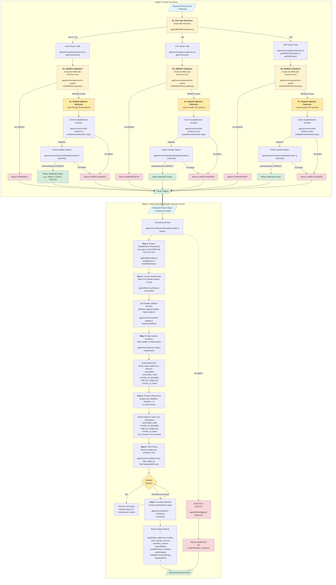

```mermaid

graph TB
    subgraph Stage5["Stage 5: Parser Discovery"]
        direction TB

        Start5[/"Sanitized Packing List<br/>+ Filename"/] --> FileType["<b>5a. File Type Detection</b><br/>Check file extension<br/><br/><i>app/utilities/file-extension.js</i>"]

        FileType -->|".xlsx or .xls"| ExcelPath["Excel Parser Path<br/><br/><i>app/services/parsers/parsers.js</i><br/>getExcelParser()"]
        FileType -->|".csv"| CsvPath["CSV Parser Path<br/><br/><i>app/services/parsers/parsers.js</i><br/>getCsvParser()"]
        FileType -->|".pdf"| PdfPath["PDF Parser Path<br/><br/><i>app/services/parsers/parsers.js</i><br/>getPdfNonAiParser() or getPdfParser()"]

        ExcelPath --> RemosCheckExcel["<b>5b. REMOS Validation</b><br/>Check for RMS-GB-XXXXXX-XXX<br/><br/><i>app/services/parsers/no-match/</i><br/>NOREMOS.matches()"]
        CsvPath --> RemosCheckCsv["<b>5b. REMOS Validation</b><br/>Check for RMS-GB-XXXXXX-XXX<br/><br/><i>app/services/parsers/no-match/</i><br/>NOREMOSCSV.matches()"]
        PdfPath --> RemosCheckPdf["<b>5b. REMOS Validation</b><br/>Check for RMS-GB-XXXXXX-XXX<br/><br/><i>app/services/parsers/no-match/</i><br/>NOREMOSPDF.matches()"]

        RemosCheckExcel -->|"No REMOS"| NoRemosExcel["Return NOREMOS"]
        RemosCheckCsv -->|"No REMOS"| NoRemosCsv["Return NOREMOSCSV"]
        RemosCheckPdf -->|"No REMOS"| NoRemosPdf["Return NOREMOSPDF"]

        RemosCheckExcel -->|"REMOS Found"| MatcherExcel["<b>5c. Retailer Matcher Selection</b><br/>Loop through Excel parsers"]
        RemosCheckCsv -->|"REMOS Found"| MatcherCsv["<b>5c. Retailer Matcher Selection</b><br/>Loop through CSV parsers"]
        RemosCheckPdf -->|"REMOS Found"| MatcherPdf["<b>5c. Retailer Matcher Selection</b><br/>Loop through PDF parsers"]

        MatcherExcel --> EstNumCheckExcel["Check Establishment Number<br/><br/><i>app/services/model-headers.js</i><br/>establishmentNumber.regex"]
        MatcherCsv --> EstNumCheckCsv["Check Establishment Number<br/><br/><i>app/services/model-headers-csv.js</i><br/>establishmentNumber.regex"]
        MatcherPdf --> EstNumCheckPdf["Check Establishment Number<br/><br/><i>app/services/model-headers-pdf.js</i><br/>establishmentNumber.regex"]

        EstNumCheckExcel -->|"Matches"| HeaderCheckExcel["Check Header Pattern<br/><br/><i>app/services/matchers/[retailer]/model*.js</i><br/>matches()"]
        EstNumCheckCsv -->|"Matches"| HeaderCheckCsv["Check Header Pattern<br/><br/><i>app/services/matchers/[retailer]/model*.js</i><br/>matches()"]
        EstNumCheckPdf -->|"Matches"| HeaderCheckPdf["Check Header Pattern<br/><br/><i>app/services/matchers/[retailer]/model*.js</i><br/>matches()"]

        HeaderCheckExcel -->|"matcherResult.CORRECT"| ParserFoundExcel["Return Matched Parser<br/>e.g., ASDA1, COOP1, TESCO2"]
        HeaderCheckCsv -->|"matcherResult.CORRECT"| ParserFoundCsv["Return Matched Parser"]
        HeaderCheckPdf -->|"matcherResult.CORRECT"| ParserFoundPdf["Return Matched Parser"]

        HeaderCheckExcel -->|"No Match"| UnrecognisedExcel["Return UNRECOGNISED"]
        HeaderCheckCsv -->|"No Match"| UnrecognisedCsv["Return UNRECOGNISED"]
        HeaderCheckPdf -->|"No Match"| UnrecognisedPdf["Return UNRECOGNISED"]

        EstNumCheckExcel -->|"No Match"| UnrecognisedExcel
        EstNumCheckCsv -->|"No Match"| UnrecognisedCsv
        EstNumCheckPdf -->|"No Match"| UnrecognisedPdf

        NoRemosExcel --> End5[/"Parser Object"/]
        NoRemosCsv --> End5
        NoRemosPdf --> End5
        UnrecognisedExcel --> End5
        UnrecognisedCsv --> End5
        UnrecognisedPdf --> End5
        ParserFoundExcel --> End5
        ParserFoundCsv --> End5
        ParserFoundPdf --> End5
    end

    End5 ==> Start6

    subgraph Stage6["Stage 6: Data Extraction (Retailer-Specific Parser)"]
        direction TB

        Start6[/"Matched Parser Object<br/>+ Packing List Data"/] --> ParseCall["Call parser.parse()<br/><br/><i>app/services/parsers/[retailer]/model*.js</i><br/>parse()"]

        ParseCall --> ExtractEstNum["<b>Step 1:</b> Extract Establishment Number(s)<br/>Use regex to find RMS-GB-XXXXXX-XXX<br/><br/><i>app/utilities/regex.js</i><br/>findMatch() or findAllMatches()"]

        ExtractEstNum --> FindHeader["<b>Step 2:</b> Locate Header Row<br/>Search for header pattern in rows<br/><br/><i>app/utilities/row-finder.js</i><br/>rowFinder()"]

        FindHeader --> HeaderCallback["Use header callback function<br/>Matches against header regex patterns<br/><br/><i>app/services/matches-header.js</i><br/>matchesHeader()"]

        HeaderCallback --> MapCols["<b>Step 3:</b> Map Column Positions<br/>Map headers to field names<br/><br/><i>app/services/parser-map.js</i><br/>mapParser()"]

        MapCols --> FindCols["findHeaderCols()<br/>Match regex patterns to columns:<br/>- description<br/>- commodity_code<br/>- number_of_packages<br/>- total_net_weight_kg<br/>- country_of_origin"]

        FindCols --> ProcessRows["<b>Step 4:</b> Process Data Rows<br/>Iterate from dataRow (header + 1)<br/>to end of sheet"]

        ProcessRows --> ExtractFields["Extract fields for each row:<br/>- description<br/>- commodity_code<br/>- number_of_packages<br/>- total_net_weight_kg<br/>- country_of_origin<br/>- row_location (row number)"]

        ExtractFields --> FilterTotals["<b>Step 5:</b> Filter Rows<br/>Remove totals and summary rows<br/><br/><i>app/services/validators/row-filter-utilities.js</i><br/>filterValidatableRows()"]

        FilterTotals --> MultipleSheets{Multiple<br/>Sheets?}

        MultipleSheets -->|"Yes"| NextSheet["Process next sheet<br/>Repeat steps 2-5<br/>Concatenate results"]
        NextSheet --> MultipleSheets

        MultipleSheets -->|"All sheets processed"| Combine["<b>Step 6:</b> Combine Results<br/>Create standardized output<br/><br/><i>app/services/parser-combine.js</i><br/>combine()"]

        Combine --> OutputStructure["Return Parser Result:<br/>{<br/>  registration_approval_number,<br/>  items: [array of items],<br/>  business_checks,<br/>  parserModel,<br/>  establishment_numbers,<br/>  unitInHeader,<br/>  validateCountryOfOrigin,<br/>  blanketNirms<br/>}"]

        ParseCall -.->|"Exception"| ErrorHandler["Catch Error<br/>Log error<br/><br/><i>app/utilities/logger.js</i><br/>logError()"]
        ErrorHandler --> ReturnNoMatch["Return NOMATCH<br/>via combineParser.combine()"]

        OutputStructure --> End6[/"Structured Parser Result"/]
        ReturnNoMatch --> End6
    end

    style Start5 fill:#e1f5ff
    style End5 fill:#d4edda
    style Start6 fill:#e1f5ff
    style End6 fill:#d4edda
    style FileType fill:#fff3cd
    style RemosCheckExcel fill:#fff3cd
    style RemosCheckCsv fill:#fff3cd
    style RemosCheckPdf fill:#fff3cd
    style MatcherExcel fill:#ffeaa7
    style MatcherCsv fill:#ffeaa7
    style MatcherPdf fill:#ffeaa7
    style NoRemosExcel fill:#f8d7da
    style NoRemosCsv fill:#f8d7da
    style NoRemosPdf fill:#f8d7da
    style UnrecognisedExcel fill:#f8d7da
    style UnrecognisedCsv fill:#f8d7da
    style UnrecognisedPdf fill:#f8d7da
    style ErrorHandler fill:#f8d7da
    style ReturnNoMatch fill:#f8d7da
    style ParserFoundExcel fill:#d4edda
    style ParserFoundCsv fill:#d4edda
    style ParserFoundPdf fill:#d4edda
    style MultipleSheets fill:#ffeaa7
```
