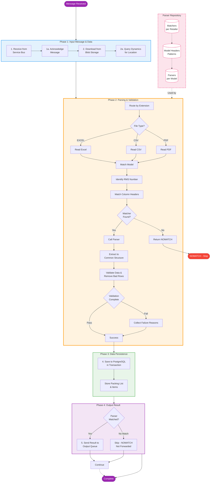

# Original PLP Processing Workflow in ADP

This document describes the high-level workflow of how the Packing List Parser (PLP) application in ADP (Azure Data Platform) processes messages from Azure Service Bus through to sending results to another queue.

## Process Overview

The PLP service follows a sequential pipeline that receives packing list references, retrieves documents, parses them using retailer-specific logic, validates the data, persists results, and forwards the outcome to downstream systems.

## Workflow Diagram

## Detailed Step Descriptions

### Parser Repository (Dependencies)

The parsing phase relies on a repository of retailer-specific configurations:

- **Matchers**: Identify document format based on establishment numbers and structure
- **Model Headers**: Define regex patterns for RMS numbers and column headers for each retailer/model
- **Parsers**: Retailer-specific parsing logic for data extraction

**Key Components**:

- `app/services/matchers/` - Matcher implementations
- `app/services/model-headers.js`, `app/services/model-headers-csv.js`, `app/services/model-headers-pdf.js` - Header pattern definitions
- `app/services/parsers/[retailer]/` - Parser implementations per retailer
- `app/services/model-parsers.js` - Parser registry

### 1. Receive Message from Service Bus Queue

The application listens to the PLP topic subscription on Azure Service Bus. Each message contains metadata about a packing list document that needs to be processed, including the application ID and blob reference.

**Key Components**: `app/messaging/process-plp-message.js`

#### 1a. Complete/Acknowledge Message

The message is immediately marked as complete to prevent reprocessing. If any subsequent step fails, the message is abandoned to allow retry by the messaging infrastructure.

### 2. Retrieve Packing List from Blob Storage

Using the blob URI from the message, the application downloads the actual packing list file (Excel, CSV, or PDF) from Azure Blob Storage.

**Key Components**: `app/services/storage-account.js`, `@azure/storage-blob`

#### 2a. Get Dispatch Location from Dynamics

Before parsing, the system retrieves the dispatch location information from Dynamics 365 using the establishment ID from the message. This location is used during validation.

**Key Components**: `app/services/dynamics-service.js`

### 3. Parsing Process

#### 3a. Route by File Extension

The system determines the processing path based on the file extension:

- **EXCEL**: JSON conversion path
- **CSV**: CSV parsing path
- **PDF**: AI (Azure Form Recognizer) or coordinate-based extraction

**Key Components**: `app/services/parsers/parser-factory.js`, `app/services/parsers/parsers.js`

#### 3b. Read File Content

The appropriate reader extracts content from the file format:

- Excel files are converted to JSON structure
- CSV files are parsed into row arrays
- PDFs are processed via Azure Document Intelligence or coordinate extraction

#### 3c. Match Model Based on RMS Number and Headers

The matcher system analyzes the document to identify the retailer and format:

1. Extract establishment (RMS) numbers using regex patterns
2. Identify header row structure
3. Match against known retailer patterns

**Key Components**: `app/services/matchers/`, `app/services/parsers/[retailer]/model-headers.js`

#### 3d. Call Parser or Return NOMATCH

- If a matcher identifies the document format, the corresponding parser is invoked
- If no match is found, the system returns "NOMATCH" status

**Pattern**: Graceful degradation - no exceptions thrown

#### 3e. Extract Data to Common Structure

The retailer-specific parser extracts data fields into a standardized schema:

- `description`
- `commodity_code`
- `number_of_packages`
- `total_net_weight_kg`
- `country_of_origin`
- `row_location`

**Key Components**: `app/services/parsers/[retailer]/`, `app/services/utilities/map-parser.js`

#### 3f. Validate Data

Business rules validation ensures:

- Single RMS number requirement
- All mandatory fields present
- Data format compliance
- Empty items and bad data rows are removed
- Collection of failure reasons if validation fails

**Key Components**: `app/services/validators/packing-list-column-validator.js`, `app/services/validators/packing-list-validator-utilities.js`

### 4. Save to PostgreSQL Database (Phase 3)

Parsed data and validation results are persisted to the PostgreSQL database in a transaction. Both the packing list record and associated items are saved atomically. This happens regardless of whether parsing succeeded or failed (NOMATCH status is also persisted).

**Key Components**: `app/packing-list/index.js`, `app/models/`, `app/services/database-service.js`

### 5. Send Result to Output Queue (Phase 4)

The processing result is sent to the TP (Trade Platform) output queue via Azure Service Bus. The message includes:

- Application ID
- Parsed result status (success/failure based on validation)
- Failure reasons (if applicable)

**Note**: Messages are only sent if a parser was matched (NOMATCH results are not forwarded to downstream systems).

**Key Components**: `app/messaging/send-parsed-message.js`, `app/messaging/create-message.js`

## Error Handling

Throughout the workflow, errors are logged but processing continues with graceful degradation:

- Unparseable documents return "NOMATCH" status
- Validation failures are captured with specific reasons
- All outcomes are persisted and forwarded for visibility

## Key Technologies

- **Azure Service Bus**: Message queue integration
- **Azure Blob Storage**: Document storage
- **Azure Document Intelligence**: AI-based PDF parsing
- **PostgreSQL**: Data persistence
- **Sequelize**: ORM for database operations
- **Hapi.js**: API framework for route handling
